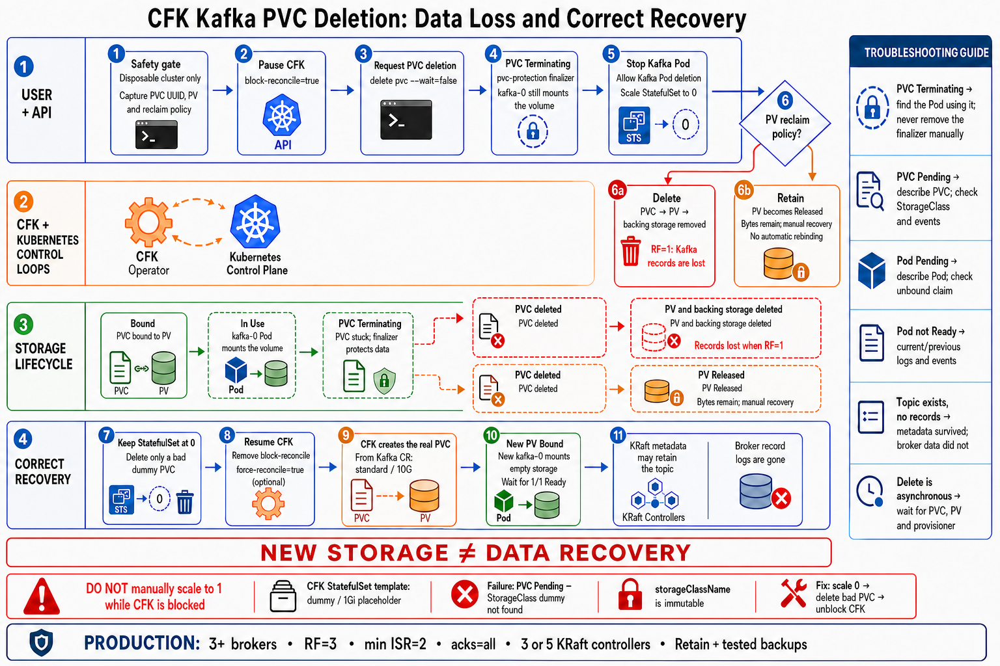

# CFK Kafka PVC deletion: end-to-end flow and recovery

> **Destructive procedure:** Use this only on a disposable learning cluster. Deleting a Kafka broker PVC can permanently destroy records.



## What this flow proves

The observed learning cluster has one Kafka broker, topic replication factor `1`, one KRaft controller, and a Kafka PV with reclaim policy `Delete`.

In that configuration:

```text
Delete Kafka PVC
        |
        v
Delete-policy PV and its backing storage are removed
        |
        v
The only copy of each Kafka partition log is lost
```

The KRaft controller PVC is separate. It can retain topic names, partition assignments, and configuration metadata, but it does not contain the Kafka records stored in the deleted broker partition logs.

## End-to-end ownership and sequence

| Phase | Actor | What happens | What to observe |
|---|---|---|---|
| 1. Safety gate | Operator at the terminal | Confirms the context is disposable and captures the old PVC UID, PV name, reclaim policy, topic, offsets, and records | A written before-state that can be compared with the replacement storage |
| 2. Pause CFK | Kubernetes API and CFK operator | The `block-reconcile=true` annotation prevents CFK from immediately undoing the temporary StatefulSet scale change | The Kafka CR remains, but CFK pauses reconciliation for it |
| 3. Request deletion | Kubernetes API | The PVC receives a deletion timestamp | The claim shows `Terminating` instead of disappearing immediately |
| 4. Protect active storage | PVC protection controller | `kubernetes.io/pvc-protection` prevents final deletion while `kafka-0` still references the claim | The finalizer remains; do not remove it manually |
| 5. Stop Kafka | StatefulSet controller and kubelet | The StatefulSet is temporarily scaled to `0`; kubelet stops the broker and unmounts the filesystem | `kafka-0` disappears and no Pod references `data0-kafka-0` |
| 6. Finish claim deletion | PVC/PV controllers | PVC protection can now remove its finalizer and finish deletion | The old PVC becomes `NotFound` |
| 7a. `Delete` branch | PV controller and storage provisioner | The PV object and its backing storage are removed asynchronously | Old PV eventually becomes `NotFound`; RF=`1` records are lost |
| 7b. `Retain` branch | PV controller | The PV changes to `Released`; backing bytes remain | Manual recovery is required; a new PVC does not automatically rebind it |
| 8. Resume CFK | CFK operator | Reconciliation is unblocked while the StatefulSet remains at `0` | CFK regains ownership of the desired state |
| 9. Recreate storage | CFK, provisioner, scheduler, and kubelet | CFK creates the real PVC from the Kafka CR, the provisioner creates a PV, and CFK restores the desired broker replica | In this lab: `standard`, `10G`, `Bound`, followed by `kafka-0` becoming Ready |
| 10. Kafka rejoins | Kafka broker and KRaft controller | The broker mounts a new empty filesystem and rejoins the KRaft-managed Kafka cluster; it does not become a controller-quorum member | Topic metadata can exist even though the old records do not |

Kubernetes does not copy records from the deleted PV into the new PV. New storage is not data recovery.

## Pre-flight checks

Stop test producers and consumers before beginning. A client running through `kubectl exec` in `kafka-0` ends when that Pod is deleted. An external client can retry during the outage, so do not use messages sent during the disruption as persistence evidence.

```bash
kubectl config current-context

kubectl -n confluent get kafka kafka \
  -o jsonpath='brokers={.spec.replicas}{"\n"}'

kubectl -n confluent get kraftcontroller kraftcontroller \
  -o jsonpath='controllers={.spec.replicas}{"\n"}'

kubectl -n confluent get pod kafka-0

kubectl -n confluent get pvc data0-kafka-0 \
  -o custom-columns='PVC:.metadata.name,UID:.metadata.uid,PV:.spec.volumeName,SC:.spec.storageClassName,REQUEST:.spec.resources.requests.storage,STATUS:.status.phase'
```

Capture the old volume and policy:

```bash
OLD_PVC_UID=$(kubectl -n confluent get pvc data0-kafka-0 \
  -o jsonpath='{.metadata.uid}')

OLD_PV=$(kubectl -n confluent get pvc data0-kafka-0 \
  -o jsonpath='{.spec.volumeName}')

OLD_RECLAIM=$(kubectl get pv "$OLD_PV" \
  -o jsonpath='{.spec.persistentVolumeReclaimPolicy}')

echo "OLD_PVC_UID=$OLD_PVC_UID"
echo "OLD_PV=$OLD_PV"
echo "OLD_RECLAIM=$OLD_RECLAIM"
```

Describe the topic and consume its baseline records before deleting storage:

```bash
kubectl -n confluent exec kafka-0 -c kafka -- \
  kafka-topics \
  --bootstrap-server kafka:9092 \
  --describe \
  --topic storage-loss-topic

kubectl -n confluent exec kafka-0 -c kafka -- \
  kafka-console-consumer \
  --bootstrap-server kafka:9092 \
  --topic storage-loss-topic \
  --from-beginning \
  --timeout-ms 10000 \
  --property print.partition=true \
  --property print.offset=true \
  --property print.value=true
```

Do not continue if the context, resources, or recorded data belong to a shared or production environment.

## Critical CFK behavior: the `dummy` claim template

In the observed CFK deployment, the generated StatefulSet claim template is a placeholder:

```text
StatefulSet template: storageClassName=dummy, request=1Gi
Healthy CFK PVC:      storageClassName=standard, request=10G
```

CFK normally pre-creates the real PVC from the Kafka CR before the StatefulSet creates the Pod. The Pod then uses that existing claim.

Inspect both sides:

```bash
kubectl -n confluent get statefulset kafka \
  -o jsonpath='{range .spec.volumeClaimTemplates[*]}name={.metadata.name}{" sc="}{.spec.storageClassName}{" request="}{.spec.resources.requests.storage}{"\n"}{end}'

kubectl -n confluent get pvc data0-kafka-0 \
  -o custom-columns='PVC:.metadata.name,SC:.spec.storageClassName,REQUEST:.spec.resources.requests.storage,CAPACITY:.status.capacity.storage,PV:.spec.volumeName,STATUS:.status.phase'
```

### Do not manually scale back to one while CFK is blocked

This is unsafe in this CFK deployment:

```bash
# Do not run this while block-reconcile=true
kubectl -n confluent scale statefulset kafka --replicas=1
```

The StatefulSet controller can create `data0-kafka-0` from the placeholder template. The result is a `Pending` PVC requesting a nonexistent `dummy` StorageClass and only `1Gi`. When CFK resumes, it cannot change that PVC's immutable `storageClassName` to the real class.

Do not create a `dummy` StorageClass and do not patch the bad PVC. Keep the StatefulSet at `0`, delete only the confirmed bad placeholder claim, and return control to CFK.

## Correct recreation sequence

At the end of the destructive deletion phase, keep the generated StatefulSet at zero:

```bash
kubectl -n confluent scale statefulset kafka --replicas=0
```

Normally, `data0-kafka-0` is now absent. If it exists, inspect it before doing anything:

```bash
kubectl -n confluent get pvc data0-kafka-0 \
  -o custom-columns='PVC:.metadata.name,SC:.spec.storageClassName,REQUEST:.spec.resources.requests.storage,PV:.spec.volumeName,STATUS:.status.phase'
```

Delete it only when all of the following are true:

- It is the accidental replacement, not the original valid PVC.
- It requests `dummy` and is `Pending` without a bound PV.
- `kafka-0` is absent and no Pod references the claim.

```bash
kubectl -n confluent delete pvc data0-kafka-0

kubectl -n confluent wait \
  --for=delete \
  pvc/data0-kafka-0 \
  --timeout=2m
```

Remove the temporary Pod-deletion permission, resume CFK, and request reconciliation:

```bash
kubectl -n confluent label kafka kafka \
  confluent-operator.webhooks.platform.confluent.io/allow-kafka-pod-deletion-

kubectl -n confluent annotate kafka kafka \
  platform.confluent.io/block-reconcile-

kubectl -n confluent annotate kafka kafka \
  platform.confluent.io/force-reconcile=true \
  --overwrite
```

Let CFK recreate the real claim and desired broker replica. Do not manually scale the StatefulSet to `1`.

```bash
kubectl -n confluent wait \
  --for=create \
  pvc/data0-kafka-0 \
  --timeout=5m

kubectl -n confluent wait \
  --for=jsonpath='{.status.phase}'=Bound \
  pvc/data0-kafka-0 \
  --timeout=5m

kubectl -n confluent wait \
  --for=create \
  pod/kafka-0 \
  --timeout=5m

kubectl -n confluent wait \
  --for=condition=Ready \
  pod/kafka-0 \
  --timeout=10m
```

Verify that CFK created the desired storage rather than the placeholder claim:

```bash
kubectl -n confluent get pvc data0-kafka-0 \
  -o custom-columns='PVC:.metadata.name,UID:.metadata.uid,SC:.spec.storageClassName,REQUEST:.spec.resources.requests.storage,CAPACITY:.status.capacity.storage,PV:.spec.volumeName,STATUS:.status.phase'
```

For this lab, the expected storage class is `standard`, the request/capacity is `10G`, and the phase is `Bound`. The PVC UID and PV name must differ from the captured old values.

## Prove the data-loss outcome before producing again

First check whether the surviving KRaft metadata still describes the topic:

```bash
kubectl -n confluent exec kraftcontroller-0 -c kraftcontroller -- \
  kafka-topics \
  --bootstrap-server kafka:9092 \
  --describe \
  --topic storage-loss-topic
```

Then attempt to read the old records without producing any new ones:

```bash
kubectl -n confluent exec kafka-0 -c kafka -- \
  kafka-console-consumer \
  --bootstrap-server kafka:9092 \
  --topic storage-loss-topic \
  --from-beginning \
  --timeout-ms 10000 \
  --property print.partition=true \
  --property print.offset=true \
  --property print.value=true
```

The topic can still exist while its previous records are unavailable. Only after recording this result should you produce new messages. New messages are stored on the new PV; they are not recovered old messages.

## Real-time troubleshooting matrix

| Symptom | Likely layer or cause | Immediate checks | Safe response |
|---|---|---|---|
| PVC remains `Terminating` | A Pod still references it; PVC protection is working | `kubectl describe pvc`; search Pods for `claimName: data0-kafka-0` | Stop the referencing workload normally; never remove the protection finalizer manually |
| PVC is `Pending`, class `dummy`, request `1Gi` | StatefulSet was scaled to `1` while CFK was blocked | Describe PVC; inspect StatefulSet claim template and operator events | Keep/scale StatefulSet to `0`; delete only the confirmed bad claim; unblock and force-reconcile CFK |
| Operator reports `spec is immutable` | CFK is attempting to correct the accidental placeholder PVC | Kafka events and operator logs | Do not patch the claim or create `dummy`; remove the bad claim using the ordered recovery above |
| PVC is `Pending` with the intended StorageClass | Provisioner, capacity, topology, or `WaitForFirstConsumer` problem | Describe PVC; get StorageClasses; inspect scheduler/provisioner events | Correct the storage-layer cause before changing Kafka resources |
| Pod is `Pending` | Its PVC is unbound or scheduling constraints cannot be met | Describe Pod and PVC; inspect recent events | Resolve the claim or scheduling issue; do not repeatedly delete the Pod |
| Pod becomes `Error`, then `Running` with a higher restart count | Kafka failed once during initialization and the container runtime restarted it | `kubectl logs --previous`; container `lastState`; events | Confirm it reaches `1/1 Ready`; preserve the failure evidence |
| PVC is `Bound`, but Kafka never becomes Ready | Broker storage/KRaft metadata mismatch or Kafka startup error | Current and previous Kafka logs; Kafka/KRaft CR conditions | On this disposable RF=`1` lab, perform a complete rebuild if normal reconciliation cannot recover it |
| Topic exists but old records do not | KRaft metadata survived; broker log bytes did not | Topic describe, earliest/latest offsets, timed consumer | Treat the records as lost; do not confuse metadata survival with data recovery |
| Old PV remains after PVC deletion with `Delete` | Provisioner deletion is asynchronous or failing | PV events, provisioner logs, reclaim policy | Wait and investigate the storage provisioner; do not assume deletion is synchronous |
| PV is `Released` | Reclaim policy is `Retain` | PV claim reference and backend status | Preserve it and follow a documented manual recovery procedure; it will not automatically rebind |
| KafkaRestClass reports DNS or connection errors | Kafka Service has no healthy broker endpoint during recovery | Services, endpoints, Kafka Pod readiness | Fix the broker/storage problem first; the REST error is downstream |

Useful live watches:

```bash
kubectl -n confluent get pod,pvc -w

kubectl -n confluent get events \
  --sort-by=.metadata.creationTimestamp

kubectl -n confluent logs deployment/confluent-operator \
  --since=10m

kubectl -n confluent logs kafka-0 -c kafka \
  --tail=200

kubectl -n confluent logs kafka-0 -c kafka \
  --previous \
  --tail=200
```

`--previous` works only when the Kafka container restarted inside the current Pod. It cannot retrieve logs from a deleted Pod object.

## Production safeguards

This single-node lab demonstrates storage lifecycle behavior, not production high availability. A common production baseline includes:

- At least three Kafka brokers distributed across failure domains.
- Topic replication factor `3`, `min.insync.replicas=2`, and producers using `acks=all`.
- Three or five dedicated KRaft controllers so the quorum can tolerate controller failure.
- Pod anti-affinity or topology spreading, PodDisruptionBudgets, capacity monitoring, and production-grade persistent storage.
- A deliberate reclaim-policy decision. `Retain` reduces the risk that PVC deletion automatically destroys the backing volume, but it requires manual cleanup and recovery procedures.
- Tested cross-cluster replication, tiered storage, or backups with verified restore exercises. Kafka replication is high availability, not a complete backup strategy.
- Restricted RBAC and admission controls so routine users cannot delete Kafka PVCs or bypass CFK safeguards.

Confluent recommends at least three brokers and three controllers for production KRaft deployments. Kubernetes notes that the default `Delete` behavior for dynamically provisioned volumes can be inappropriate for valuable data.

References:

- [Run Kafka in production with Confluent Platform](https://docs.confluent.io/platform/7.9/kafka/deployment.html)
- [Configure KRaft for Confluent Platform](https://docs.confluent.io/platform/7.9/kafka-metadata/config-kraft.html)
- [Block CFK reconciliation](https://docs.confluent.io/operator/current/co-troubleshooting.html#block-kubernetes-object-reconciliation)
- [Kubernetes storage-object-in-use protection](https://kubernetes.io/docs/concepts/storage/persistent-volumes/#storage-object-in-use-protection)
- [Change a PV reclaim policy](https://kubernetes.io/docs/tasks/administer-cluster/change-pv-reclaim-policy/)
