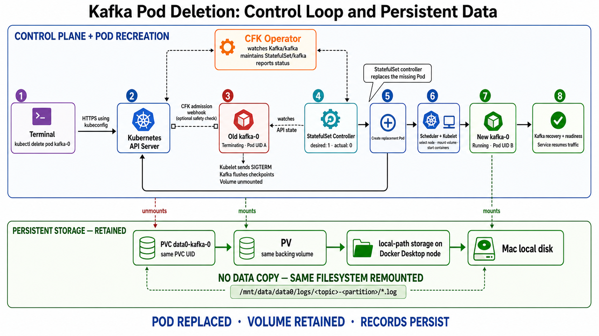

# Lab: Verify Kafka data persistence after Pod deletion

This lab demonstrates how Kubernetes recreates a deleted CFK-managed Kafka Pod and how Kafka records survive because the replacement Pod mounts the same PersistentVolumeClaim (PVC).

## Learning objectives

By the end of the lab, you will be able to:

- Observe the StatefulSet controller recreating `kafka-0`.
- Distinguish a stable Pod name from a unique Pod UID.
- Confirm that the replacement Pod mounts the original PVC and PersistentVolume (PV).
- Verify that acknowledged Kafka records survive Pod deletion.
- Understand which deletion operations preserve data and which operations destroy it.

## Lab environment

The commands assume the following local CFK environment:

| Resource | Value |
|---|---|
| Kubernetes namespace | `confluent` |
| Kafka custom resource | `kafka` |
| Kafka StatefulSet | `kafka` |
| Kafka Pod | `kafka-0` |
| Kafka PVC | `data0-kafka-0` |
| Kafka bootstrap Service | `kafka:9092` |
| Kafka replicas | `1` |

## PVC and PV fundamentals

Kubernetes separates an application's request for storage from the infrastructure that provides the storage.

| Object | Scope | Fundamental role |
|---|---|---|
| StorageClass | Cluster-wide | Describes how Kubernetes should dynamically provision storage |
| PersistentVolume (PV) | Cluster-wide | Represents the actual backing storage made available to Kubernetes |
| PersistentVolumeClaim (PVC) | Namespaced | Requests storage and provides a stable reference that a Pod can mount |
| Pod volume mount | Pod-specific | Exposes the PVC-backed filesystem at a path inside a container |

The PVC is not a directory containing data. It is a Kubernetes API object that says, in effect, "I need storage with these properties." Kubernetes binds that claim to a compatible PV. The actual bytes are stored by the PV's backing storage system.

The relationship is:

```text
Kafka container
    |
    | mounts /mnt/data/data0
    v
PVC data0-kafka-0
    |
    | bound to
    v
PersistentVolume
    |
    | provisioned by the StorageClass
    v
Underlying disk, cloud volume, network storage, or local-path directory
```

Important lifecycle properties:

- Deleting a Pod normally does not delete its PVC.
- A StatefulSet gives each Pod ordinal a stable PVC identity, such as `data0-kafka-0` for `kafka-0`.
- A replacement Pod mounts the existing filesystem; Kubernetes does not copy the old Pod's data.
- A PV's reclaim policy controls what happens to the backing storage after its PVC is deleted.
- `Retain` preserves the backing PV for manual recovery; `Delete` asks the provisioner to delete the backing storage.

### Where this cluster actually stores Kafka data

For this Docker Desktop cluster, the storage path is:

```text
Kafka records
    |
    v
/mnt/data/data0/logs/<topic>-<partition>/00000000000000000000.log
    |
    v
PVC data0-kafka-0
    |
    v
PV provisioned by rancher.io/local-path
    |
    v
/var/local-path-provisioner/<volume-directory> on the Kubernetes node
    |
    v
Docker Desktop's managed Linux storage
    |
    v
The Mac's physical local disk
```

The `/var/local-path-provisioner/...` path exists inside the Docker Desktop Kubernetes node environment, not as a normal directly managed macOS folder. Docker Desktop ultimately stores that node filesystem in its managed virtual disk on the Mac.

For Kafka, CFK configures:

```text
log.dirs=/mnt/data/data0/logs
```

Each partition has its own directory. For example, partition 2 of `viral-topic` is stored under:

```text
/mnt/data/data0/logs/viral-topic-2/
```

Typical files include:

| File | Purpose |
|---|---|
| `*.log` | Binary Kafka record batches—the actual messages |
| `*.index` | Maps logical offsets to positions in the log segment |
| `*.timeindex` | Maps timestamps to offsets |
| `partition.metadata` | Partition metadata, including its topic identity |
| `leader-epoch-checkpoint` | Tracks leader epochs for recovery and replication |

Do not edit these files manually. Use Kafka producers, consumers, and administration tools.

You can discover the current mapping with:

```bash
kubectl -n confluent get pvc data0-kafka-0 -o wide
kubectl get pv
kubectl get storageclass

kubectl -n confluent exec kafka-0 -c kafka -- \
  grep '^log.dirs=' /mnt/config/shared/kafka.properties
```

## Safety warning

This lab intentionally stops the only Kafka broker, so producers and consumers will be unavailable while `kafka-0` restarts. Run it only against a disposable local learning cluster.

This experiment verifies already acknowledged records. Do not produce new records while the Pod is terminating.

During the persistence portion of the lab, do **not**:

- Delete `data0-kafka-0`.
- Delete the `Kafka/kafka` custom resource.
- Reset the Docker Desktop Kubernetes cluster.
- Use `--force` or `--grace-period=0` when deleting the Pod.

## 1. Verify the starting state

Confirm that Kafka and its storage are healthy:

```bash
kubectl -n confluent get kafka kafka
kubectl -n confluent get statefulset kafka
kubectl -n confluent get pod kafka-0
kubectl -n confluent get pvc data0-kafka-0
```

The Kafka Pod should be `Running`, and the PVC should be `Bound`.

Check the StatefulSet's PVC retention policy:

```bash
kubectl -n confluent get statefulset kafka \
  -o jsonpath='whenDeleted={.spec.persistentVolumeClaimRetentionPolicy.whenDeleted}{" whenScaled="}{.spec.persistentVolumeClaimRetentionPolicy.whenScaled}{"\n"}'
```

For this environment, the expected result is:

```text
whenDeleted=Retain whenScaled=Retain
```

## 2. Create a disposable topic

Create a dedicated topic so the experiment does not affect other test data:

```bash
kubectl apply -f - <<'EOF'
apiVersion: platform.confluent.io/v1beta1
kind: KafkaTopic
metadata:
  name: persistence-lab
  namespace: confluent
spec:
  kafkaClusterRef:
    name: kafka
  replicas: 1
  partitionCount: 1
  configs:
    cleanup.policy: "delete"
EOF
```

Watch the custom resource until CFK successfully creates the Kafka topic:

```bash
kubectl -n confluent get kafkatopic persistence-lab -w
```

Press `Ctrl+C` after the topic is ready. If its status becomes `ERROR`, inspect it before continuing:

```bash
kubectl -n confluent get kafkatopic persistence-lab -o yaml
kubectl -n confluent logs deployment/confluent-operator --since=5m
```

## 3. Produce ten test records

Run this from your local terminal. `kubectl exec -i` passes the output of `seq` to the producer running inside `kafka-0`:

```bash
seq 10 | kubectl -n confluent exec -i kafka-0 -c kafka -- \
  kafka-console-producer \
  --bootstrap-server kafka:9092 \
  --topic persistence-lab
```

The producer returning without an error indicates that the records were acknowledged.

## 4. Establish a data baseline

Read the ten records and include their partition and offset metadata:

```bash
kubectl -n confluent exec kafka-0 -c kafka -- \
  kafka-console-consumer \
  --bootstrap-server kafka:9092 \
  --topic persistence-lab \
  --from-beginning \
  --max-messages 10 \
  --timeout-ms 10000 \
  --property print.partition=true \
  --property print.offset=true \
  --property print.value=true
```

Example:

```text
Partition:0  Offset:0  1
Partition:0  Offset:1  2
...
Partition:0  Offset:9  10
```

## 5. Record the Pod and PVC identities

Record the current Pod UID:

```bash
kubectl -n confluent get pod kafka-0 \
  -o custom-columns='NAME:.metadata.name,UID:.metadata.uid,PHASE:.status.phase'
```

Record the PVC UID and bound PV:

```bash
kubectl -n confluent get pvc data0-kafka-0 \
  -o custom-columns='NAME:.metadata.name,UID:.metadata.uid,PV:.spec.volumeName,STATUS:.status.phase'
```

Keep both outputs for comparison after the restart.

## 6. Watch the control loop

Open a second terminal and watch `kafka-0`:

```bash
kubectl -n confluent get pod kafka-0 -w
```

Optionally, watch Kubernetes events in a third terminal:

```bash
kubectl -n confluent get events --watch \
  --field-selector involvedObject.name=kafka-0
```

## 7. Delete only the Kafka Pod

In the original terminal, request a normal graceful deletion:

```bash
kubectl -n confluent delete pod kafka-0
```

Do not add force-deletion flags. Depending on the configured termination grace period and Kafka shutdown time, recreation may take several minutes.

The watch should show a sequence similar to:

```text
Running -> Terminating -> Pending -> ContainerCreating -> Running
```

The replacement has the same stable name, `kafka-0`, but it is a new Pod object with a new UID.

### If CFK blocks the deletion

If a CFK validation webhook rejects the request, allow Kafka Pod deletion temporarily for this disposable lab:

```bash
kubectl -n confluent label kafka kafka \
  confluent-operator.webhooks.platform.confluent.io/allow-kafka-pod-deletion=true \
  --overwrite
```

Retry the normal Pod deletion. Remove the exception after the experiment:

```bash
kubectl -n confluent label kafka kafka \
  confluent-operator.webhooks.platform.confluent.io/allow-kafka-pod-deletion-
```

## 8. Wait for the replacement Pod

After the new `kafka-0` appears, wait for its readiness probe to succeed:

```bash
kubectl -n confluent wait \
  --for=condition=Ready \
  pod/kafka-0 \
  --timeout=5m
```

Check the Kafka custom resource as well:

```bash
kubectl -n confluent get kafka kafka
```

## 9. Compare the Pod and PVC identities

Run the identity commands again:

```bash
kubectl -n confluent get pod kafka-0 \
  -o custom-columns='NAME:.metadata.name,UID:.metadata.uid,PHASE:.status.phase'

kubectl -n confluent get pvc data0-kafka-0 \
  -o custom-columns='NAME:.metadata.name,UID:.metadata.uid,PV:.spec.volumeName,STATUS:.status.phase'
```

Expected comparison:

| Object | Expected result |
|---|---|
| Pod name | Still `kafka-0` |
| Pod UID | Different because this is a new Pod object |
| PVC name | Still `data0-kafka-0` |
| PVC UID | Unchanged |
| PV name | Unchanged |

## 10. Verify that the records persisted

Consume the records again:

```bash
kubectl -n confluent exec kafka-0 -c kafka -- \
  kafka-console-consumer \
  --bootstrap-server kafka:9092 \
  --topic persistence-lab \
  --from-beginning \
  --max-messages 10 \
  --timeout-ms 10000 \
  --property print.partition=true \
  --property print.offset=true \
  --property print.value=true
```

Success means that values `1` through `10` are still present with the same partition offsets.

You can also inspect the physical Kafka partition directory:

```bash
kubectl -n confluent exec kafka-0 -c kafka -- \
  ls -lh /mnt/data/data0/logs/persistence-lab-0/
```

The actual records are stored in Kafka's binary `.log` segment files. Use Kafka consumers rather than opening or modifying those files directly.

## What Kubernetes did



```text
Pod kafka-0 is deleted
        |
        v
StatefulSet/kafka observes 0 actual replicas but still desires 1
        |
        v
The StatefulSet controller creates a new Pod named kafka-0
        |
        v
The existing data0-kafka-0 PVC is mounted into the new Pod
        |
        v
Kafka reads the existing partition log segments and recovers
        |
        v
The original records are available again
```

CFK maintains the desired Kafka deployment and its generated StatefulSet. Kubernetes' built-in StatefulSet controller is responsible for restoring the missing Pod replica.

### Responsibilities during Pod deletion

| Component | Responsibility |
|---|---|
| `kubectl` | Sends the Pod deletion request using the current kubeconfig context |
| Kubernetes API server | Authenticates, authorizes, validates, and records the deletion |
| CFK admission webhook, when enabled | Can reject an unsafe Kafka Pod deletion before it proceeds |
| CFK operator | Watches the Kafka custom resource and keeps its generated StatefulSet aligned with the Kafka specification |
| StatefulSet controller | Detects that actual replicas are below the desired replica count and requests a replacement `kafka-0` |
| Scheduler | Selects a compatible node, including the PV's node-affinity requirements |
| Kubelet | Stops the old containers, unmounts the volume, mounts it for the replacement Pod, and starts the new containers |
| Kafka process | Opens the existing log segments, performs recovery if necessary, and begins serving traffic |
| Readiness probe and Service | Keep traffic away until the replacement Kafka container is ready |

The immediate replacement of a missing Pod is primarily a Kubernetes StatefulSet-controller action. CFK remains important because it originally translated `Kafka/kafka` into the StatefulSet and continuously ensures that generated resource remains correct.

### What is retained and what is replaced

```text
REPLACED                              RETAINED
--------                              --------
Pod object                            PVC object
Pod UID                               PVC UID
Container process                     PV identity
Container writable layer              Kafka partition log files
                                      Topic records and offsets
```

There is no transfer of all records from the old Pod to the new Pod. The kubelet remounts the same PV, and Kafka reopens the same files.

## Professional troubleshooting model

Troubleshoot this workflow one layer at a time instead of jumping directly into the Kafka logs.

### Layer 1: Desired state and CFK reconciliation

Questions:

- Is the `Kafka` custom resource healthy?
- Does CFK still desire one broker?
- Did the operator report a reconciliation error?

```bash
kubectl -n confluent get kafka kafka -o yaml
kubectl -n confluent logs deployment/confluent-operator --since=10m
```

### Layer 2: Workload controller

Questions:

- Does `StatefulSet/kafka` still exist?
- Does it desire one replica?
- Is `kafka-0` owned by that StatefulSet?

```bash
kubectl -n confluent get statefulset kafka -o wide
kubectl -n confluent describe statefulset kafka
kubectl -n confluent get pod kafka-0 \
  -o jsonpath='{.metadata.ownerReferences[0].kind}{"/"}{.metadata.ownerReferences[0].name}{"\n"}'
```

### Layer 3: Scheduling and storage

Questions:

- Is the replacement Pod `Pending`?
- Is the PVC still `Bound`?
- Is volume node affinity preventing scheduling?
- Are there mount or attach failures in the events?

```bash
kubectl -n confluent describe pod kafka-0
kubectl -n confluent get pvc data0-kafka-0 -o wide
kubectl get pv
kubectl -n confluent get events --sort-by=.lastTimestamp
```

### Layer 4: Container startup and Kafka recovery

Questions:

- Did the init container finish?
- Did Kafka encounter corrupt segments, permission problems, or recovery delays?
- What happened in the previous terminated container?

```bash
kubectl -n confluent get pod kafka-0 \
  -o jsonpath='{range .status.initContainerStatuses[*]}{.name}{"="}{.state}{"\n"}{end}'

kubectl -n confluent logs kafka-0 -c config-init-container
kubectl -n confluent logs kafka-0 -c kafka
kubectl -n confluent logs kafka-0 -c kafka --previous
```

`--previous` is useful only when Kubernetes still has logs for a previously terminated instance of that container in the current Pod. It cannot retrieve logs from a Pod object that has already been deleted.

### Layer 5: Kafka data verification

Questions:

- Does the topic still exist?
- Are partition leaders available?
- Can a consumer read the expected offsets and values?

```bash
kubectl -n confluent exec kafka-0 -c kafka -- \
  kafka-topics --bootstrap-server kafka:9092 \
  --describe --topic persistence-lab

kubectl -n confluent exec kafka-0 -c kafka -- \
  kafka-console-consumer \
  --bootstrap-server kafka:9092 \
  --topic persistence-lab \
  --from-beginning \
  --max-messages 10 \
  --property print.partition=true \
  --property print.offset=true \
  --property print.value=true
```

## Controlled data-deletion comparison

Deleting the disposable `KafkaTopic` custom resource is intentionally destructive: CFK deletes the real Kafka topic and its records.

```bash
kubectl -n confluent delete kafkatopic persistence-lab
```

Confirm that the topic no longer exists:

```bash
kubectl -n confluent exec kafka-0 -c kafka -- \
  kafka-topics \
  --bootstrap-server kafka:9092 \
  --describe \
  --topic persistence-lab
```

The expected result is a topic-not-found error. Reapplying the topic manifest creates a new empty topic; it does not restore the deleted records.

## Persistence outcome matrix

| Operation | Pod outcome | Storage outcome | Expected record outcome |
|---|---|---|---|
| Delete `kafka-0` normally | StatefulSet recreates it | Same PVC/PV remounted | Records persist |
| Kafka container crashes | Container or Pod restarts | Same PVC remains | Acknowledged records persist |
| Restart Docker Desktop without resetting Kubernetes | Workloads restart | Existing Docker/Kubernetes storage normally remains | Records normally persist |
| Delete `KafkaTopic/persistence-lab` | Broker remains | Topic partition files are deleted | Topic records are lost |
| Kafka retention expires | Broker remains | Kafka removes expired log segments | Expired records are lost |
| Delete `data0-kafka-0` | Kafka becomes unhealthy | Backing PV may be deleted | Broker data is lost |
| Delete `Kafka/kafka` with a `Delete` reclaim policy | Kafka deployment is removed | PVC/PV may be deleted | Broker data is lost |
| Reset or delete the Docker Desktop cluster | Cluster resources are removed | Local cluster volumes are removed | Data is lost |

Do not test PVC, Kafka CR, or cluster deletion against data you care about. Use a separate throwaway cluster for those destructive cases.

## Troubleshooting

### The replacement Pod remains Pending

```bash
kubectl -n confluent describe pod kafka-0
kubectl -n confluent get pvc data0-kafka-0
kubectl -n confluent get events --sort-by=.lastTimestamp
```

### Kafka starts but the custom resource is not ready

```bash
kubectl -n confluent get kafka kafka -o yaml
kubectl -n confluent logs deployment/confluent-operator --since=10m
```

### The consumer reports zero records

Confirm the topic name and inspect it:

```bash
kubectl -n confluent exec kafka-0 -c kafka -- \
  kafka-topics --bootstrap-server kafka:9092 --list

kubectl -n confluent exec kafka-0 -c kafka -- \
  kafka-topics --bootstrap-server kafka:9092 \
  --describe --topic persistence-lab
```

## Expected conclusion

The experiment succeeds when all of these statements are true:

- `kafka-0` is automatically recreated.
- Its Pod UID changes.
- `data0-kafka-0` keeps the same PVC UID and PV name.
- Values `1` through `10` remain readable with their original offsets.

This demonstrates the central persistence rule:

> Pods are replaceable runtime objects. The PVC, not the Pod, owns the durable Kafka storage.

## References

- [Kubernetes Persistent Volumes and Claims](https://kubernetes.io/docs/concepts/storage/persistent-volumes/)
- [Kubernetes StorageClasses](https://kubernetes.io/docs/concepts/storage/storage-classes/)
- [Kubernetes StatefulSets](https://kubernetes.io/docs/concepts/workloads/controllers/statefulset/)
- [Deleting a StatefulSet and its storage](https://kubernetes.io/docs/tasks/run-application/delete-stateful-set/)
- [Confluent for Kubernetes storage configuration](https://docs.confluent.io/operator/current/co-storage.html)
- [CFK deletion-protection webhooks](https://docs.confluent.io/operator/current/co-deploy-cfk.html)
