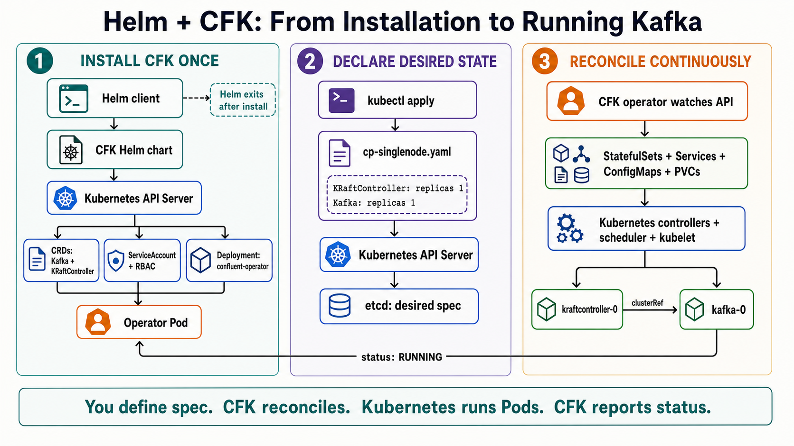

# Helm and CFK: end-to-end flow



The diagram separates the workflow into three phases: installing CFK, declaring the desired state, and continuously reconciling that state into running Kafka infrastructure.

## 1. Install CFK once

Helm acts as the installer and release manager:

1. The Helm client downloads and reads the CFK Helm chart.
2. It combines the chart templates with the configured Helm values.
3. It submits the rendered Kubernetes resources to the Kubernetes API server.
4. Kubernetes creates the Confluent CRDs, the operator's ServiceAccount and RBAC permissions, and the `confluent-operator` Deployment.
5. The Deployment creates an operator Pod.

The CRDs teach the API server about Confluent resource types such as `Kafka` and `KRaftController`. RBAC gives the operator permission to watch those resources and manage the Kubernetes resources needed to implement them.

Helm exits after the installation command finishes. It does not continuously manage the Kafka Pods; that is the operator's job.

## 2. Declare the desired state

The following command submits the custom resources from `cp-singlenode.yaml`:

```bash
kubectl apply -f cp-singlenode.yaml
```

The file requests:

- One `KRaftController` replica named `kraftcontroller`.
- One `Kafka` replica named `kafka`.
- A dependency from `Kafka/kafka` to `KRaftController/kraftcontroller` through `clusterRef`.

`kubectl` sends these objects to the Kubernetes API server. The API server validates them using the installed CRDs and persists their `spec` fields in etcd. The `spec` represents the desired state supplied by the user.

## 3. Reconcile continuously

The CFK operator watches the Kubernetes API for Confluent custom resources. When it sees the two resources from `cp-singlenode.yaml`, it creates or updates the lower-level resources required to implement them, including:

- StatefulSets
- Services
- ConfigMaps
- PersistentVolumeClaims

The standard Kubernetes controllers, scheduler, storage provisioner, and kubelet then turn those objects into the running `kraftcontroller-0` and `kafka-0` Pods and their persistent storage.

The operator repeatedly compares the requested state with the observed state. If something changes or drifts, it reconciles the generated resources again. It also writes information such as `RUNNING` and `readyReplicas` into the custom resources' `status` fields through the API server.

## Ownership of each part

| Component | Responsibility |
|---|---|
| User and `cp-singlenode.yaml` | Define the desired state in `spec` |
| CRDs | Define and validate the `Kafka` and `KRaftController` API types |
| Kubernetes API server and etcd | Validate, authorize, and persist the resources |
| CFK operator | Interpret the custom resources and continuously reconcile them |
| Kubernetes controllers and kubelet | Schedule and run the generated workloads |
| CFK operator | Report the observed result in `status` |

The short version is: **you define `spec`; CFK reconciles it; Kubernetes runs the Pods; CFK reports `status`.**
