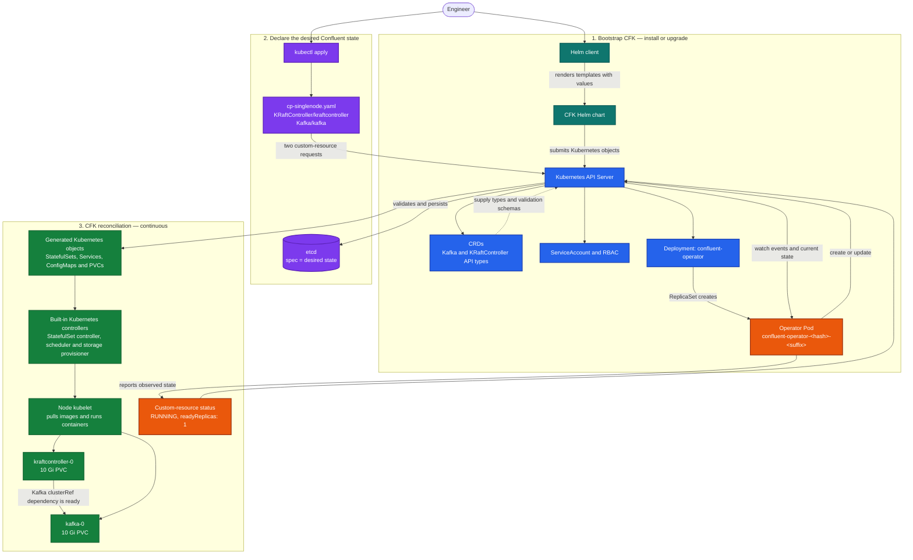

# Helm and CFK: end-to-end flow

## Reading the diagram

- **Helm bootstraps CFK:** it renders and submits CRDs, permissions, and the operator Deployment, then the Helm process exits.
- **The CRDs teach the API server new types:** they make `Kafka` and `KRaftController` valid Kubernetes resources.
- **Your file owns desired state:** `spec` in `cp-singlenode.yaml` says that one KRaft controller and one Kafka broker should exist.
- **The operator owns reconciliation:** it watches those custom resources and creates or updates the lower-level Kubernetes objects needed to realize the requested state.
- **Kubernetes owns execution:** built-in controllers, the scheduler, storage provisioner, and kubelet create PVCs, select a node, and run the Pods.
- **The operator reports observed state:** it writes readiness and lifecycle information under each custom resource's `status`.

The operator Pod's random-looking name is generated from the Deployment name, a ReplicaSet hash, and a unique Pod suffix. Its name may change; its reconciliation role does not.
